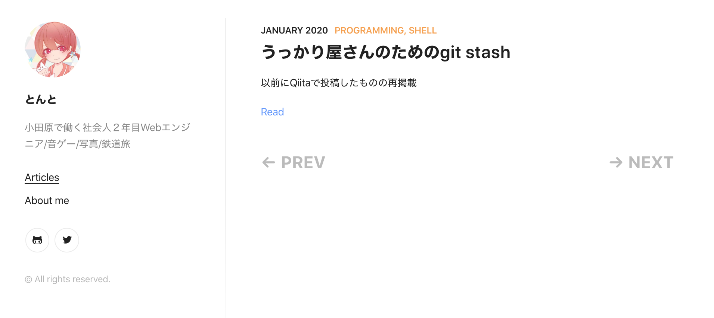
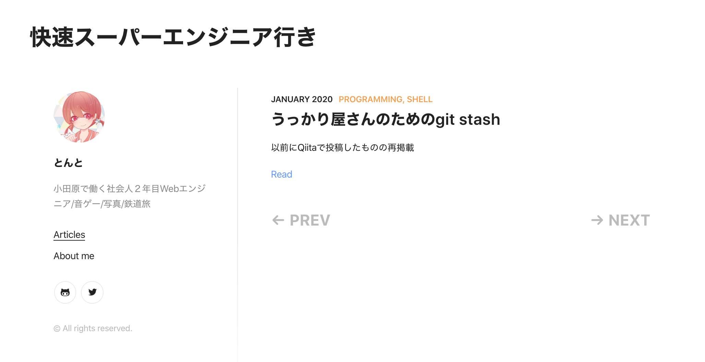

# はじめに

こんにちは。

GatsbyテンプレートからこのWebサイトを立ち上げて早２週間ほどが経とうとしていますが、僕はあることに気がつきました。それは…


**コードほとんど触ってないやんけ！！！！！！！！！！！！！！！！！！！！１１**


そうです。テンプレートは[こちら](<https://github.com/alxshelepenok/gatsby-starter-lumen>)なのですが、今までに変更を加えたものは

* サンプル記事の削除
* About Meの更新
* TwitterとGithubのアカウントの向き先の変更
* READMEの更新


。。。。。。。。。。。。。。。。。。。。。。。。

**プログラマーっぽいこと何にもやってない！！！！！！！！！**


なので今回はせっかくGatsbyJSに触れるチャンスなので、このテンプレートに１つ要素を加えてアレンジをしたいと思います。


# 完成図

今回はブログのタイトルをトップページにh1タグとして追加するという修正を行いました。

## Before



## After




# 実装

今回の実装の流れとしては、

1. Headerコンポーネント の作成(今考えるとHeaderって名前色々とヤバい)
2. 作成したHeaderコンポーネント をindexテンプレートに追加

です。


まずはHeaderコンポーネント を作ります。

とりあえずはh1タグでタイトルだけを表示させます。

再利用可能なUIコンポーネント とするために、このような書き方をします。

```javascript
import React from "react"

const Header = props => (
    <div className="header">
        <h1>{props.title}</h1>
    </div>
)

export default Header;
```


[Gatsby-starter-lumen](<https://github.com/alxshelepenok/gatsby-starter-lumen>)ではトップページのコンポーネント は`Layout`というプロフィールと投稿記事を包括しているコンポーネント が存在していたので、`index-tenplate.js`を編集し、`Layout`コンポーネント の中にさきほど作成したHeaderコンポーネント を追加します。

```html
<Layout title={pageTitle} description={siteSubtitle}>
      <Header title="快速スーパーエンジニア行き" />
      <Sidebar isIndex />
```


# おわりに

コード修正量はそんなに多くないですが、Reactを今までに触ったことが無かったので、コンポーネント やCSS Moludeの概念を理解していなかったので既存のコードを読んで理解するのに圧倒的に時間がかかりました。

今回はh1タグで適当にブログのタイトルを追加しただけですが、今後もGatsby Tutorialなどを進めながらフロントの世界を理解しつつこのブログをモダンにアップデート出来たらなと思います((꜆꜄ ˙꒳˙)꜆꜄꜆ﾊﾟﾝﾁﾊﾟﾝﾁ