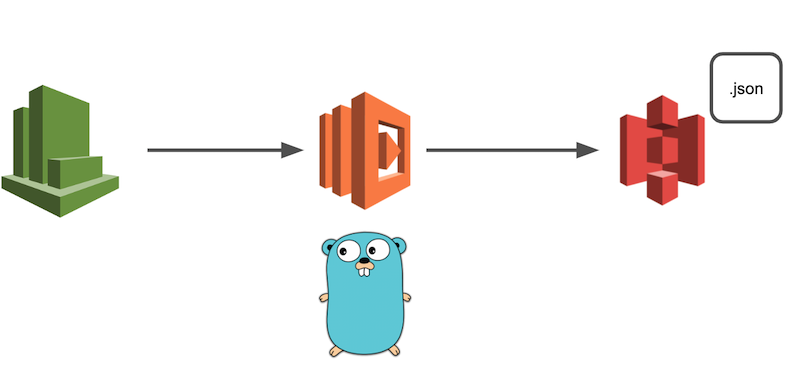
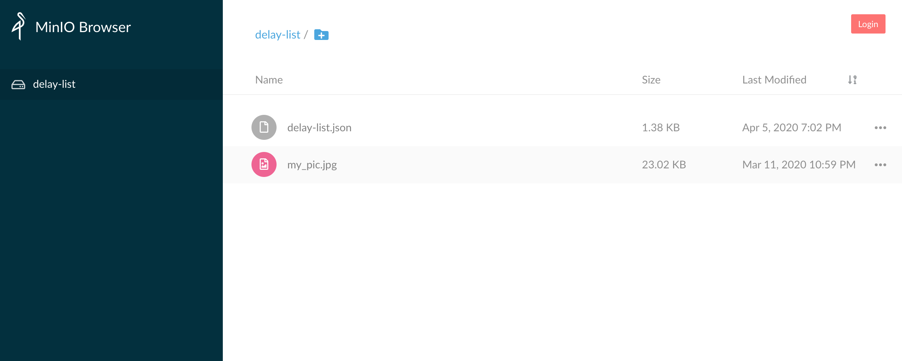

# はじめに

この記事は、AWS SAMを用いてファイルをS3にアップロードするLambda関数を作成する記事です。

# やりたいこと

今回は、何かしらのファイル(本記事ではJSON)をS3にアップロードする処理を、AWS SAMを用いてCloutWatchイベントから定期的に発火させる、ということをやっていきます。



# 開発環境

- macOS Catalina
- vim
- Golang (1.12.6)
- aws-sam-cli
- Minio


# SAMの設定

今回は[AWS SAM](<https://docs.aws.amazon.com/ja_jp/serverless-application-model/latest/developerguide/what-is-sam.html>)というAWSが提供しているオープンソースフレームワークを用いてLambda関数の環境を構築します。

SAMを使うことによって、構成管理やソースコードのアップデートやデプロイなどをコマンド1つで完了することが出来るのでとても便利です。

今回はAPI-Gatewayなどは使用せずLambda関数のみを作成するだけなのでSAMの恩恵はちょっと感じられにくいですが、AWSを使って何か開発をやってみようと考えている人は是非導入してみましょう。

SAMの導入手順は公式ドキュメントやそれを分かりやすく解説している記事があるのでこの記事では省略します。

- [Installing the AWS SAM CLI on macOS](<https://docs.aws.amazon.com/serverless-application-model/latest/developerguide/serverless-sam-cli-install-mac.html>)
- [AWS SAM で Hello World する](<https://qiita.com/mokuo/items/3348f19d12cb9b17295d>)
- [[アップデート]AWS SAMのデプロイが簡単になりました](<https://dev.classmethod.jp/articles/aws-sam-simplifies-deployment/>)


# 実装してみる

ここからは、SAMの設定などを既に完了しており、Lambda関数を作成できている前提でお話しします。

今回実装したリポジトリは[こちら](<https://github.com/RyuseiNomi/DelayListFetcher>)です。

**ファイル構成**

```bash
├── Makefile <-- ローカル実行コマンドなどをまとめたファイル
├── README.md
├── src <-- Lambda関数のソースコード
	└── fetcher
		└── urlFetcher.go <-- URLからJSONを取得する処理を記述したファイル
	├── handler
		└── handler.go <-- mainパッケージから実行される処理
	├── json
		└── jsonWorker.go <-- JSONファイルの作成や書き出しなどを行う処理
	├── s3
		└── uploader.go <-- Sessionの生成やアップロードを行う処理
├── docker-compose.yaml <-- ローカル開発用のMinioコンテナの情報
└── template.yaml <-- Lambdaなどの全体構成を指定するファイル
```

### SAMテンプレートの設定

今回作成するLambda関数のインフラストラクチャ及びコンポーネントの設定をします。
設定はtemplate.yamlに全て書き込みます。buildやdeployをする際、このファイルを元にLambda関数が作成されます。
詳しいパラメータについては[公式ドキュメント](https://docs.aws.amazon.com/ja_jp/codedeploy/latest/userguide/tutorial-lambda-sam-template.html)を参考にしてください。
例えば、1時間に1回発火するLambda関数を作成する場合の設定は以下の通りです。

```
Resources:
   SampleFunction:
     Type: AWS::Serverless::Function
     Properties:
       CodeUri: src/
       Handler: handler
       FunctionName: SampleFunction
       Runtime: go1.x
       Tracing: Active
       Events:
         CatchAll:
           Type: Schedule
           Properties:
             Schedule: rate(1 hour)
             Name: one-hour-rule
             Description: Exec each one-hour
             Enabled: True
       Environment:
         Variables:
           PARAM1: VALUE
```

### Minioの環境構築

今回、S3へのアップロードを行うLambdaの開発を行うわけですが、ローカルでの開発を行う際に実際のバケットにアクセスしてファイルを追加したり削除したりするのはちょっと怖いですよね。

そこで今回は[Minio](<https://min.io/>)というクラウドストレージサーバをローカルではS3のバケットに見立てて開発をしていきます。

これを使うことでlocalhost上でバケットの作成やファイルの追加・削除をすることが出来るので安心です。

MinioはDockerイメージを公開しているので、Minioの環境構築自体はdocker-composeファイルを作成するだけです。

```
version: "2"
services:
  minio:
    image: minio/minio
    ports:
      - "9000:9000"
    command: [server, /data]
    environment:
      - "MINIO_ACCESS_KEY=dummy"
      - "MINIO_SECRET_KEY=dummy"
      - "MINIO_REGION=ap-northeast-1"
    restart: always
networks:
  default:
    external:
      name: sample_network
```

特に注目したいのが `environment`です。

通常、S3のバケットにアクセスするにはIAMロールかAssume Roleの`Access Key ID`と`Secret Key`が必要になります。ここでは、Minioコンテナにアクセスする際の`Access Key ID`と`Secret Key`を設定できます。

後ほど書きますが、この情報がCredentialを作成するときに必要となります。

```
environment/:
      - "MINIO_ACCESS_KEY=dummy"
      - "MINIO_SECRET_KEY=dummy"
      - "MINIO_REGION=ap-northeast-1"
```

一度 `docker-compose up -d`を実行してMinioコンテナが立ち上がるか確かめてみましょう。

```
docker ps                                                                                      [develop]
CONTAINER ID        IMAGE               COMMAND                  CREATED             STATUS              PORTS                    NAMES
267811ea93f7        minio/minio         "/usr/bin/docker-ent…"   3 weeks ago         Up 3 weeks          0.0.0.0:9000->9000/tcp   samplefunction_minio_1
```

立ち上がっていることを確認できたら、実際にアクセスしてみましょう。
今回の場合だと、`localhost:9000`になります。
ちなみに、画面上からもバケットの作成やファイルのアップロードが可能ですので、予めバケットを作成するときは画面上からも行うことが出来ます。
今回私は画面上から作成しました。



### ファイルに書き込みたい情報の準備

まずはファイルに書き込みたい情報を準備しましょう。
今回はサンプルとしてAPIなどを叩いて得られた情報をJSONに書き込んでいきます。
情報は、[鉄道遅延情報のJSON](<https://rti-giken.jp/fhc/api/train_tetsudo/>)から取得させていただきました。
🚨 **お約束**：ローカルでこのサンプルをそのまま実行したりする場合は、[鉄道遅延情報のJSON](<https://rti-giken.jp/fhc/api/train_tetsudo/>)の**お約束を必ず読んで**理解した上で利用しましょう。決してアクセスしまくって迷惑をかけたりしないでください。 🚨

```go

package urlFetcher

import (
	"io/ioutil"
	"log"
	"net/http"
)

var (
	url = "https://tetsudo.rti-giken.jp/free/delay.json"
)

/**
 * Fetch Bytes from Web site
 */
func GetBytesFromUrl() []byte {
	resp, err := http.Get(url)
	if err != nil {
		log.Fatal("Can not get delay list! Error: %v", err)
	}
	defer resp.Body.Close()

	delayList, _ := ioutil.ReadAll(resp.Body)

	log.Printf("Succeeded to get Delay-list!")
	return delayList
}
```

基本ここは「golang URL get」などで調べてば参考記事がたくさん出てきます。

JSONファイルの作成などを行う前に、書き込むものを準備する必要があるのでここのfunctionではそれを作成している処理になります。


### JSONの取得と保存

JSONファイルに書き込むものが準備できたところで、それをアップロードするためにファイルにする処理を記述します。流れとしては以下です。

- tempディレクトリにJSONファイルを作成するためのディレクトリと空のファイルを作成
- 作成した空のファイルにByte配列を書き込む

という感じです。

```go
package JsonWorker

import (
	"fmt"
	"os"
)

var (
	tempDir    = "/tmp/json/"
	bucketName = "delay-list"
	key        = "delay-list.json"
)

/**
 * Create empty JSON file on temp file and write bytes
 */
func CreateJSON(byteInfo []byte) error {
	if byteInfo == nil {
		return fmt.Errorf("create JSON error: %s", "nil bytes was given")
	}

	if err := os.MkdirAll(tempDir, 0777); err != nil {
		return err
	}

	file, err := os.Create(tempDir + key)
	if err != nil {
		return err
	}

	_, err = file.Write(byteInfo)
	if err != nil {
		return err
	}

	if isExist := isExistTempFile(tempDir); isExist != true {
		return fmt.Errorf("Temp file does not exist")
	}

	return nil
}

/**
 * Verify if exist temp file
 */
func isExistTempFile(tempFile string) bool {
	_, err := os.Stat(tempFile)
	return !os.IsNotExist(err)
}
```


### JSONのアップロード

tempファイルに作成されたJSONファイルを実際にS3にアップロードする処理を書きます。

今回まずは、ローカルのMinioコンテナで作成したバケットにアップロードしてみましょう。

```go
package s3Uploader

import (
	"log"
	"os"

	"github.com/aws/aws-sdk-go/aws"
	"github.com/aws/aws-sdk-go/aws/credentials"
	"github.com/aws/aws-sdk-go/aws/session"
	"github.com/aws/aws-sdk-go/service/s3/s3manager"
)

var (
	bucketName = "sample"
	key        = "sample.json"
)

/**
 * Yield new session to upload file to S3 bucket
 */
func Upload(jsonFile *os.File) error {

	var sess *session.Session

		/* Yield credential for local */
	log.Printf("Start process getting credential as a local")
	credential := credentials.NewStaticCredentials(os.Getenv("AWS_ACCESS_KEY_ID"), os.Getenv("AWS_SECRET_ACCESS_KEY"), "")
	sess, _ = session.NewSession(&aws.Config{
		Credentials:      credential,
		Region:           aws.String("ap-northeast-1"),
		Endpoint:         aws.String("http://172.18.0.2:9000"),
		S3ForcePathStyle: aws.Bool(true),
   })

	_, err := sess.Config.Credentials.Get()
	if err != nil {
		log.Fatal("Load Credential File Error:  %+v\n", err)
	}

	uploader := s3manager.NewUploader(sess)

	// Upload File With Custom Session
	_, err = uploader.Upload(&s3manager.UploadInput{
		Bucket: aws.String(bucketName),
		Key:    aws.String(key),
		Body:   jsonFile,
	})
	if err != nil {
		return err
	}

	log.Printf("Succeeded to upload delay list!")
	return nil
}
```


ここで難しいのが、**Credentialの読み込み**と**Sessionの作成**です。

通常AWSのサービスを利用する場合には認証情報が必要です。今回行うS3へのアップロードも例外ではありません。

今回は`NewStaticCredentials`メソッドを使って認証情報を取得します。今はMinioへアクセスするために先ほどMinioのコンテナを作る際に設定した`Access Key ID`と`Secret Key`を使用します。`os.Getenv()`で取得することが可能です。

```go
credential := credentials.NewStaticCredentials(os.Getenv("AWS_ACCESS_KEY_ID"), os.Getenv("AWS_SECRET_ACCESS_KEY"), "")
```

取得した認証情報をもとにS3にアクセスするためのSessionを生成します。ローカルなのでパラメータが多いですw

```go
sess, _ = session.NewSession(&aws.Config{
		Credentials:      credential,
		Region:           aws.String("ap-northeast-1"),
		Endpoint:         aws.String("http://172.18.0.2:9000"),
		S3ForcePathStyle: aws.Bool(true),
   })
```

生成したSessionをもとにUploaderを生成して実際にアップロードを行います。

```go
uploader := s3manager.NewUploader(sess)

	// Upload File With Custom Session
	_, err = uploader.Upload(&s3manager.UploadInput{
		Bucket: aws.String(bucketName),
		Key:    aws.String(key),
		Body:   jsonFile,
	})
```


### ローカルでの実行

ここまでできたら、実際に動かしてみましょう。まずはソースコードをbuildする必要があります。

```bash
sam build
```

buildが完了したらlocalで実行するコマンドを叩きましょう。

```bash
sam local invoke SampleFunction
```

`sam local invoke`コマンドについてはオプションがたくさんあるので適宜追加をしましょう。
オプションについては、[こちら](https://docs.aws.amazon.com/serverless-application-model/latest/developerguide/sam-cli-command-reference-sam-local-invoke.html)を参考にしてください。
**Dockerネットワークの指定**と**リージョンの指定**と**Profileの指定**を行う場合は以下のようになります。
**ネットワークの指定**は、さきほど作成したMinioコンテナと同じネットワークに所属させる必要があるため、同じネットワーク名を指定してあげましょう。

```bash
sam local invoke SampleFunction \
     --region ap-northeast-1 \
     --docker-network sample_network \
     --profile minio_test
```

何もエラーが起きずに実行が終了したら、Minioにアクセスしてファイルがアップロードされているか確認してみましょう。


### 本番環境とローカル環境の区別について

ローカルでの実行が完了し、いざデプロイ…といきたいところですが、今のままではMinioへのアップロードしかできていないため、このままデプロイをしてもアップロード処理でエラーになってしまいます。

ですので次は、実際にデプロイ後の動作とローカルでの動作を分ける処理を記述します。

先ほどのuploader.goのCredentialとSessionの生成の処理に分岐を加えます。

```go
if os.Getenv("AWS_SAM_LOCAL") == "true" {
		/* Yield credential for local */
		log.Printf("Start process getting credential as a local")
		credential := credentials.NewStaticCredentials(os.Getenv("AWS_ACCESS_KEY_ID"), os.Getenv("AWS_SECRET_ACCESS_KEY"), "")
		sess, _ = session.NewSession(&aws.Config{
			Credentials:      credential,
			Region:           aws.String("ap-northeast-1"),
			Endpoint:         aws.String("http://172.18.0.2:9000"),
			S3ForcePathStyle: aws.Bool(true),
		})
} else {
		/* Yield credential for production */
		log.Printf("Start process getting credential as a production")
		sess, _ = session.NewSession(&aws.Config{
			Region:           aws.String("ap-northeast-1"),
			S3ForcePathStyle: aws.Bool(true),
		})
	}
```

注目すべきは、`os.Getenv("AWS_SAM_LOCAL")`です。

SAMで実行された場合、環境変数`AWS_SAM_LOCAL`に`true`がセットされるため、Lambda関数がローカルから実行されたかどうかはこいつで判定することが出来ます。

そしてCredentialの生成についてですが、Minioでのローカル環境の場合は環境変数から`Access Key ID`と`Secret Key`を読み込みましたが、本番環境の場合はローカルシステム上の認証情報を読み込みます。

ローカルでの認証情報は`~/.aws.credentials`にあると思います。

設定がされていない方は、AWSの[公式ドキュメント](<https://docs.aws.amazon.com/ja_jp/sdk-for-java/v1/developer-guide/setup-credentials.html>)を参照ください。確かこれを使うセキュリティ上の理由などについてもどこかに書かれていた覚えがあります…(知っている方はコメントください(｀･ω･´)ゞ)

そのため、本番環境の場合にCredentialの生成処理などは特に書く必要はありません。(**Assume Roleをしている場合は別です！**)。基本的にリージョンの指定だけで大丈夫です。

```go
/* Yield credential for production */
		log.Printf("Start process getting credential as a production")
		sess, _ = session.NewSession(&aws.Config{
			Region:           aws.String("ap-northeast-1"),
			S3ForcePathStyle: aws.Bool(true),
		})
```


できたらもう一度実行して、ローカルでのデグレ検証を行います。

問題なければ実際にデプロイしましょう！以下のコマンドを実行します。初回のデプロイは`--guided`をつけましょう。

```bash
sam deploy --guided
```

これを実行し、実際にAWSマネジメントコンソールを開いてLambda関数が増えていれば成功です！

あとはCloudWatch Eventの設定を確認しつつモニタリングからログを追って成功しているかどうかを確認しましょう！


# 参考

- [Installing the AWS SAM CLI on macOS](<https://docs.aws.amazon.com/serverless-application-model/latest/developerguide/serverless-sam-cli-install-mac.html>)
- [開発用の AWS 認証情報とリージョンのセットアップ](<https://docs.aws.amazon.com/ja_jp/sdk-for-java/v1/developer-guide/setup-credentials.html>)
- [sam local invoke](https://docs.aws.amazon.com/serverless-application-model/latest/developerguide/sam-cli-command-reference-sam-local-invoke.html)
- [AWS SAM で Hello World する](<https://qiita.com/mokuo/items/3348f19d12cb9b17295d>)
- [[アップデート]AWS SAMのデプロイが簡単になりました](<https://dev.classmethod.jp/articles/aws-sam-simplifies-deployment/>)

- [鉄道遅延情報のjson](<https://rti-giken.jp/fhc/api/train_tetsudo/>)

