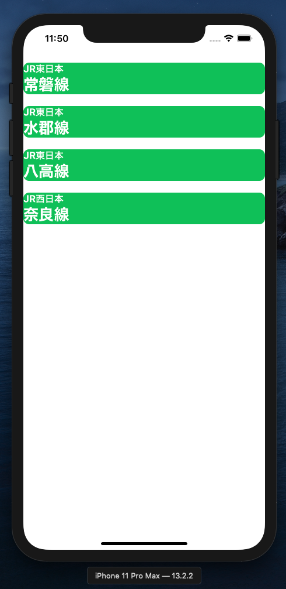

# はじめに

この記事は、SwiftUIを触りたての人がQGridというライブラリを用いてお手軽にリストセクションを作るまでを残した記事です。

# SwiftUIとは？

SwiftUIは、2019年のWWDCで発表された、従来のUIKitに変わる新しいフレームワークです。

SwiftUIを用いることで、従来より少ないコードでアプリのViewを書くことが出来るということで今回初めて導入をしてみたわけですが、なんせUIKitに慣れている人にとってはなかなか導入のハードルが高いです…

実際、SwiftUI自体にはまだコンポーネントが少なく、ちょろっと触ってみただけだと「なんだやっぱりUIKitがいいや」ってなると思われますが、SwiftUIに向けた素敵なライブラリが数多く存在しています。

[参考] [SwiftUIおすすめライブラリ!!](<https://qiita.com/shira-shun/items/492dcdd79ed9dde09bf6>)

# 作ったもの

今回はSwiftUIをサクッと試すために、以下のようなものを作りました。

路線名をただリストとして表示しているだけです。



これを作るに当たって、[QGrid](<https://github.com/Q-Mobile/QGrid>)というライブラリを導入してみました。

[QGrid](<https://github.com/Q-Mobile/QGrid>)を使うことによって、複数のCellから成るリストを簡単に作成することが出来るようになります。


# 実装してみた

### ①セルとセルの中の要素の作成

まずは素のSwiftUIを用いて表示するセルを用意します。今回セルの中身には **鉄道会社名**と**路線名**を持つようにしたいので、これら２つのフィールドとあとは付随させるIDを持つ構造体を作成します。

```swift
// Struct which has info about each train route
struct TrainRoute: Identifiable {
    var id = UUID()
    let companyName: String
    let routeName: String
}
```

その構造体から実際に画面に描画するためのいくつかのパラメータを持つCellを定義します。

```swift
// The cell which has train route info
struct TrainRouteCell: View {
    var delayList: TrainRoute
    var body: some View {
        VStack(alignment: .leading) {
            Text(delayList.companyName)
                .foregroundColor(.white)
                .fontWeight(.bold)
            Text(delayList.routeName)
                .foregroundColor(.white)
                .fontWeight(.heavy)
                .font(.title)
        }
        .frame(minWidth: 0, maxWidth: .infinity, alignment: .leading)
        .background(Color.green)
        .cornerRadius(10)
    }
}
```

私がこのコードを書いたとき、`VStack`が何者なのか全く分からずに躓いてしまったのですが、これは**水平に配置するViewのコンテナ**です。対して垂直に配置するコンテナが`HStack`だそうです。

[参考] [【Swift】SwiftUIのAlignment Guide まとめ](<https://qiita.com/shiz/items/0c41d20a2cb7b0748875>)


### ②QGridを使ってセルを並べて表示

実際に画面にセルを並べて表示させます。ここでQGridの力が発揮されます((꜆꜄ ˙꒳˙)꜆꜄꜆ﾊﾟﾝﾁﾊﾟﾝﾁ

```swift
// View which show all train route which is delaying
struct DelayListView: View {
    let trains = [
        TrainRoute(companyName: "JR東日本", routeName: "常磐線"),
        TrainRoute(companyName: "JR東日本", routeName: "水郡線"),
        TrainRoute(companyName: "JR東日本", routeName: "八高線"),
        TrainRoute(companyName: "JR西日本", routeName: "奈良線"),
    ]
    var body: some View {
        QGrid(trains,
              columns: 1,
              vSpacing: 20,
              hSpacing: 20,
              vPadding: 20,
              hPadding: 0
        ) { trainRoute in
            TrainRouteCell(delayList: trainRoute)
        }
    }
}
```

やっていることとしては、さきほど作成したTrainRouteという構造体からセルに書き出す情報を取得して配列に格納します。

生成した配列を`QGrid()`に渡してあげることで、配列の要素分だけ情報を元にセルを生成しています。

QGridにも同様のSampleCodeがREADMEに記載されていますので、そちらも併せてご覧ください。

[参考] [QGrid](<https://github.com/Q-Mobile/QGrid>)

また、[この記事](<https://swiswiswift.com/2020-02-09/>)はポケモンを画像付きで配置していてとても面白いなと思ったのでぜひ参考にしてみてください。

[参考] [SwiftUIでUICollectionViewのようにViewを並べる](<https://swiswiswift.com/2020-02-09/>)

# おわりに

SwiftUI最高だと思います((꜆꜄ ˙꒳˙)꜆꜄꜆ﾊﾟﾝﾁﾊﾟﾝﾁ

# 参考

[QGrid](<https://github.com/Q-Mobile/QGrid>)

[SwiftUIおすすめライブラリ!!](<https://qiita.com/shira-shun/items/492dcdd79ed9dde09bf6>)

[【Swift】SwiftUIのAlignment Guide まとめ](<https://qiita.com/shiz/items/0c41d20a2cb7b0748875>)
